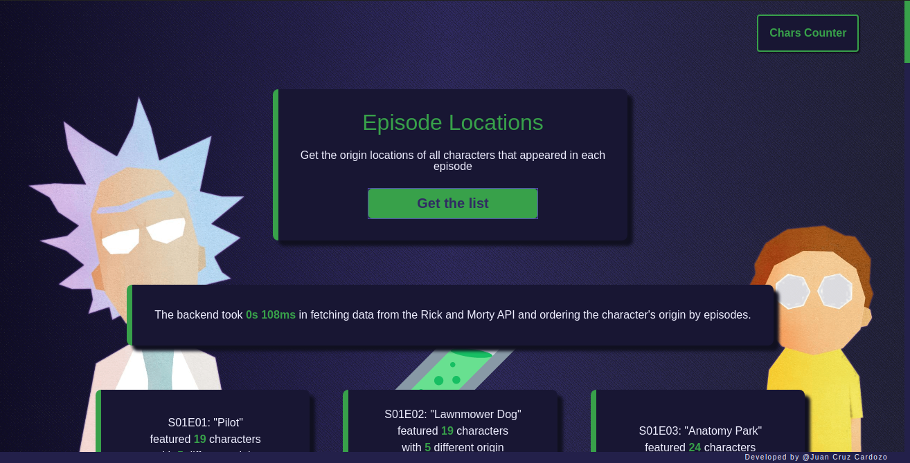

<h1 align="center">
  
   
  ⭐Chipax's Rick and Morty Challenge⭐
</h1>

Backend of the challenge, built with Express. The main logic of the challenge is in the controller of each endpoint and the execution time starts when a request arrives and stops before answer it. 

 

Click on the image to visit the live version!

 

## Built with
* [Express](https://expressjs.com/)
* [Axios](https://github.com/axios/axios)
* [Jest](https://jestjs.io/)
* [Supertest](https://github.com/visionmedia/supertest)

## Other links

* Frontend: [https://github.com/SylphidZoul/Chipax-challenge-frontend](https://github.com/SylphidZoul/Chipax-challenge-frontend)